## 0. 문서 정보

|항목|내용|
|---|---|
|프로젝트명|북켓몬 (Bookemon)|
|버전|v2.0|
|최종 수정일|2026-04-21|
|작성 근거|기능 명세서 v2.0|

> **v2.0 주요 변경 요약**
> 
> - 인증 플로우 신규 추가 (소셜 로그인 + 자체 가입 + 토큰 갱신)
> - 부화 조건 변경: XP 100 → 독서대 첫 책 등록
> - 콜드스타트 전환과 부화 이벤트 분리
> - 독서대 삭제 플로우 추가 (XP 회수 포함)
> - 뽑기 플로우에 Redis 6h 캐싱 반영
> - XP 처리에 PostgreSQL SELECT FOR UPDATE 명시
> - 도서 데이터 적재 배치 플로우 추가

---

## 1. 전체 사용자 여정 (User Journey)

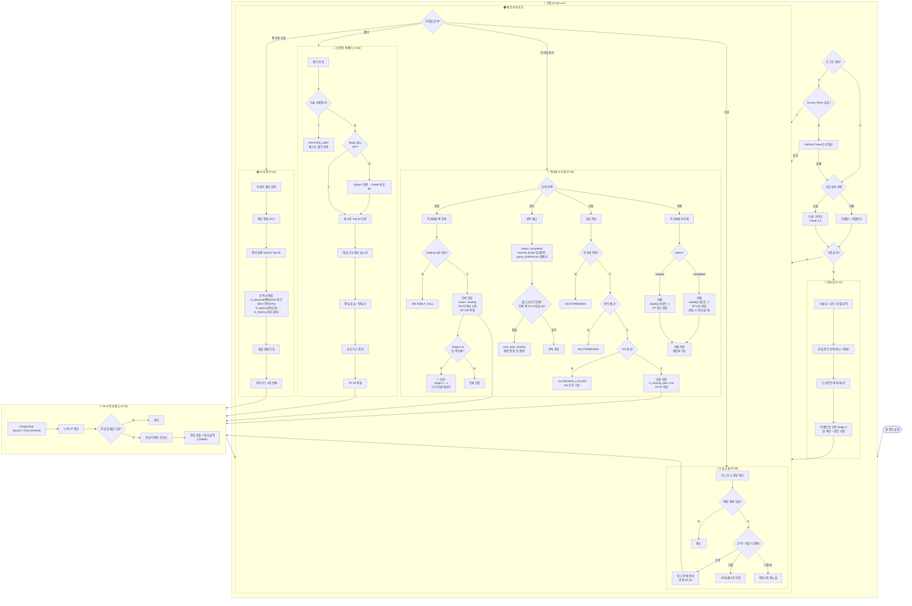

---

## 2. F-00: 인증 플로우 (v2.0 신규)

### 2-1. 소셜 로그인

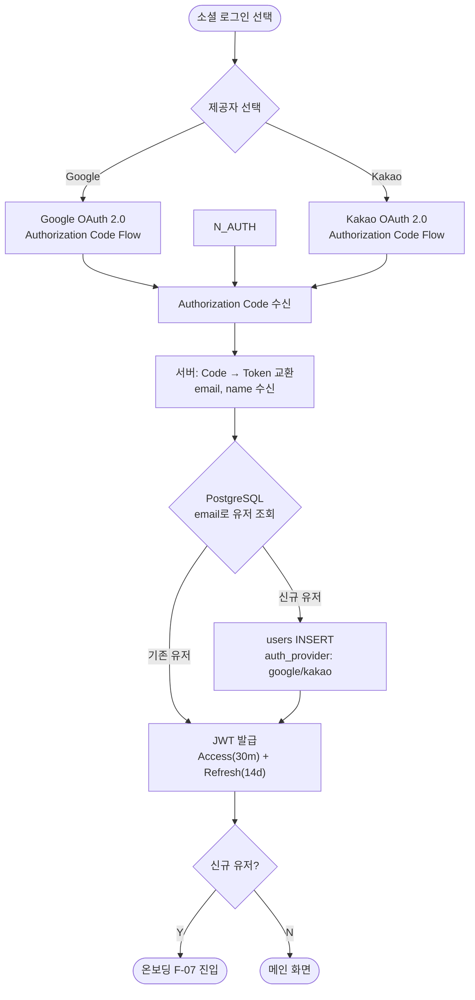

### 2-2. 자체 가입

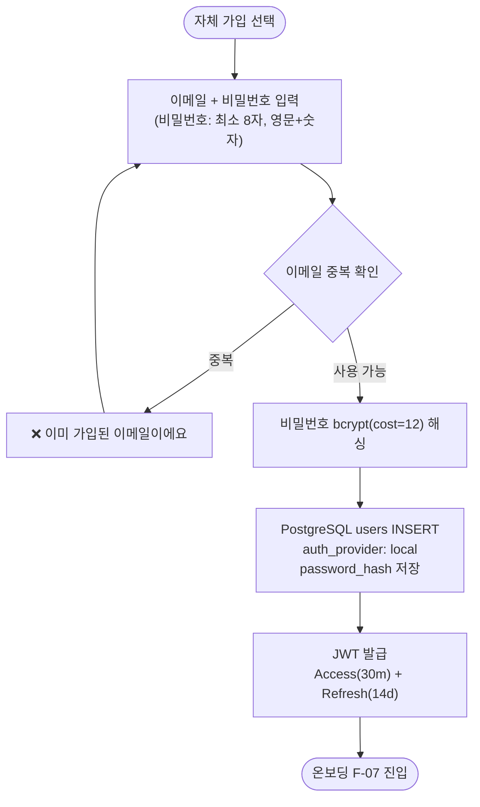

### 2-3. 토큰 갱신

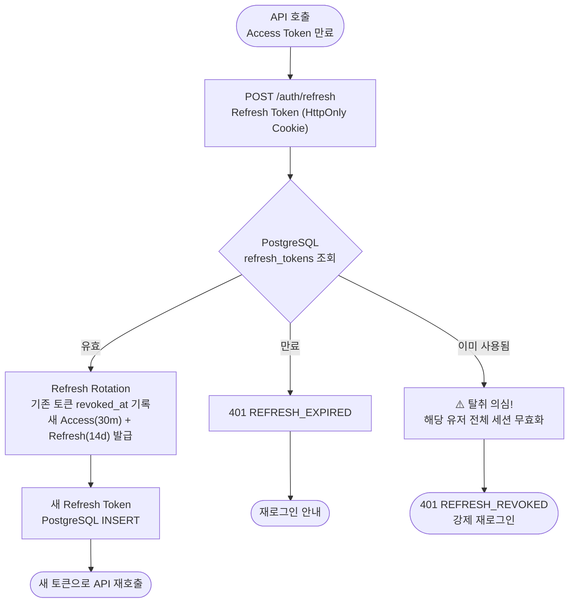

### 2-4. 로그아웃

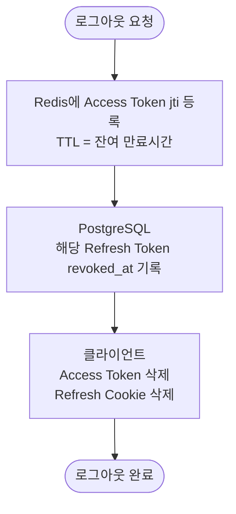

---

## 3. F-07: 온보딩 플로우

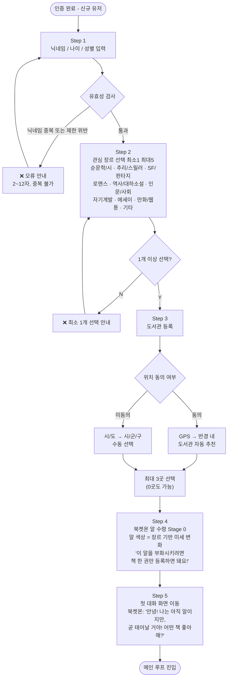

---

## 4. F-01: AI 개인화 큐레이션 플로우

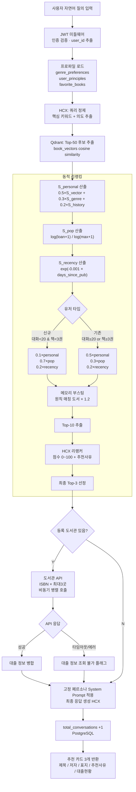

---

## 5. F-02: 운명의 책 뽑기 플로우

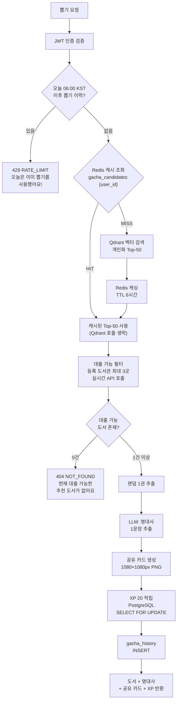

---

## 6. F-04: 독서대 & 리뷰 플로우

### 6-1. 독서대 등록 + 부화

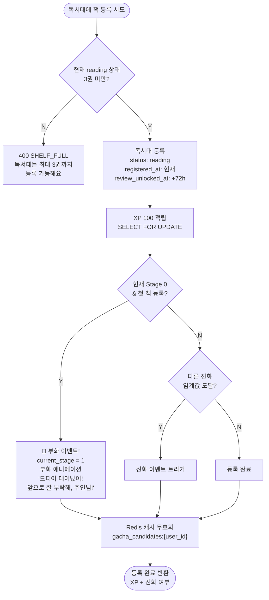

### 6-2. 완독 체크 + 콜드스타트 전환

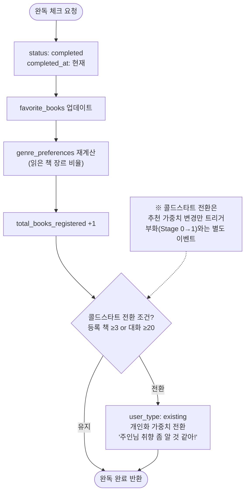

### 6-3. 리뷰 작성

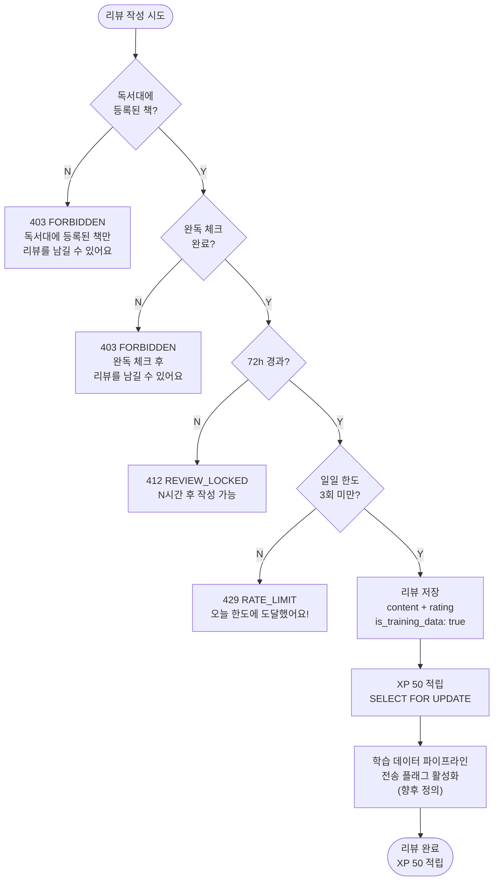

### 6-4. 독서대 삭제 (v2.0 신규)

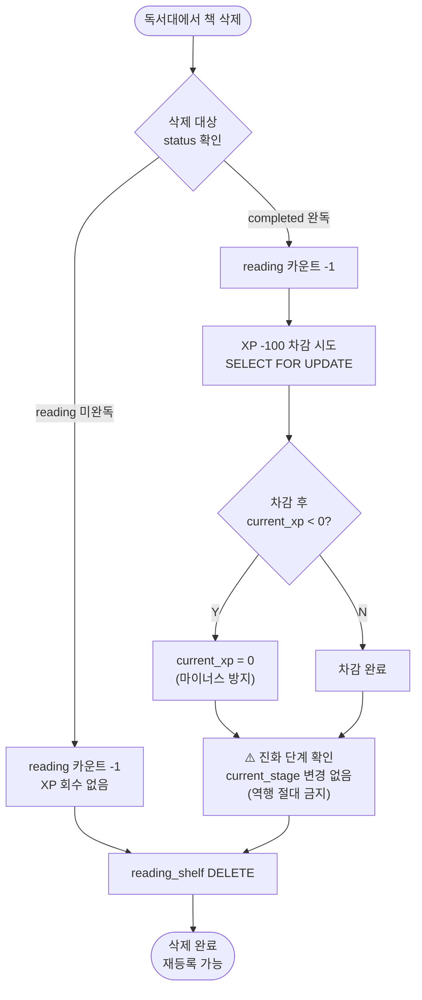

---

## 7. F-06: XP & 진화 시스템 플로우

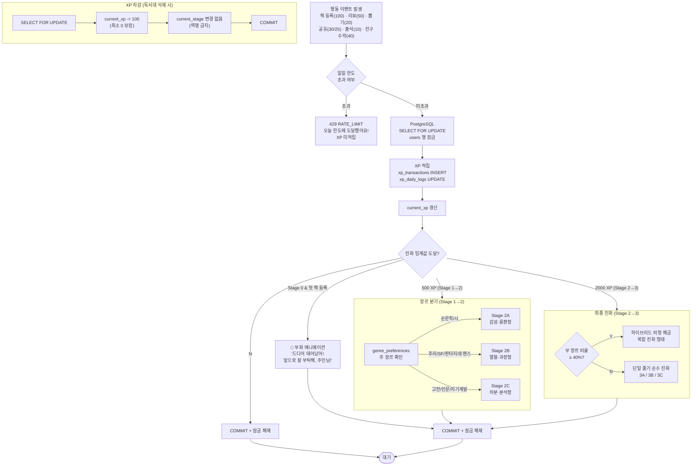

---

## 8. F-08: 소셜 매칭 플로우

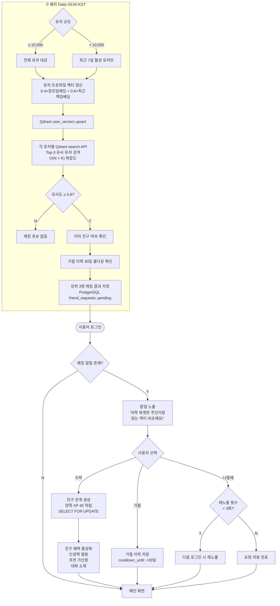

---

## 9. F-09: 공유 카드 플로우

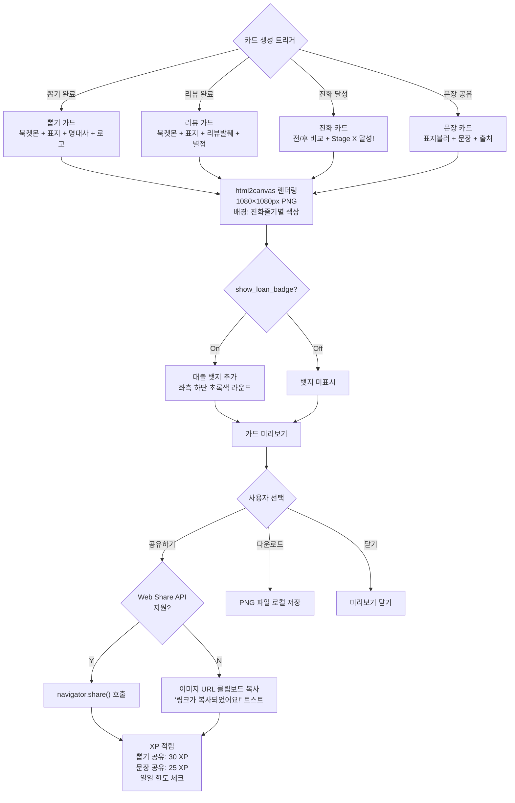

---

## 10. 배치 처리 플로우

### 10-1. 도서 데이터 적재 배치 (v2.0 신규)

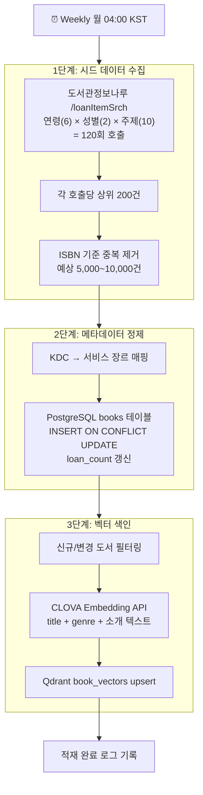

### 10-2. 뽑기 캐시 워밍 배치

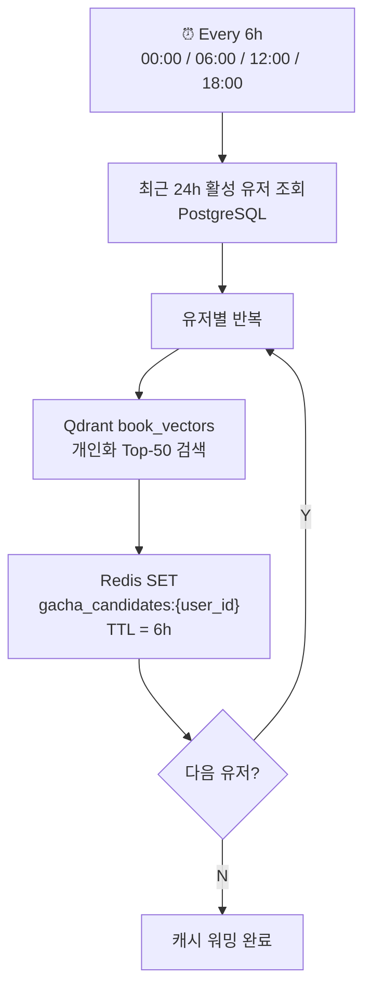

---

## 11. 에러 처리 플로우 총괄

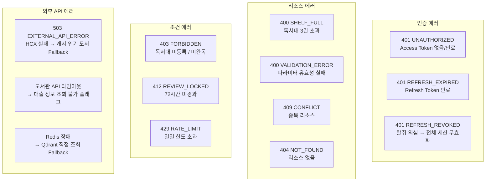

---

## 12. 변경 이력

| 버전   | 일자         | 변경 내용                                                                                                                                                                                                                                                                                                                                                       |
| ---- | ---------- | ----------------------------------------------------------------------------------------------------------------------------------------------------------------------------------------------------------------------------------------------------------------------------------------------------------------------------------------------------------- |
| v1.0 | 2026-04-21 | 초안 작성 (기능 명세서 v1.1 기반 전체 시스템 플로우 설계)                                                                                                                                                                                                                                                                                                                        |
| v2.0 | 2026-04-21 | 기능 명세서 v2.0 기반 갱신: 인증 플로우 신규 4건 (소셜 로그인 · 자체 가입 · 토큰 갱신 · 로그아웃), 부화 조건 변경 (XP 100 → 첫 책 등록), 콜드스타트 전환과 부화 이벤트 분리, 독서대 삭제 플로우 신규 (XP 회수 · 진화 역행 금지 · 재등록 허용), 뽑기 플로우에 Redis 6h 캐싱 반영 (HIT/MISS 분기), XP 처리에 PostgreSQL SELECT FOR UPDATE 명시, 리뷰 에러 코드 수정 (SHELF_FULL · REVIEW_LOCKED), 소셜 매칭 배치 확장 전략 반영 (유저 규모별 분기), 도서 데이터 적재 배치 플로우 추가, 에러 처리 플로우 총괄 섹션 신규 |