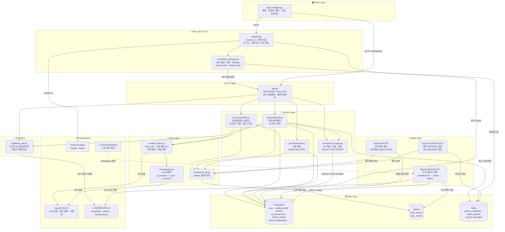
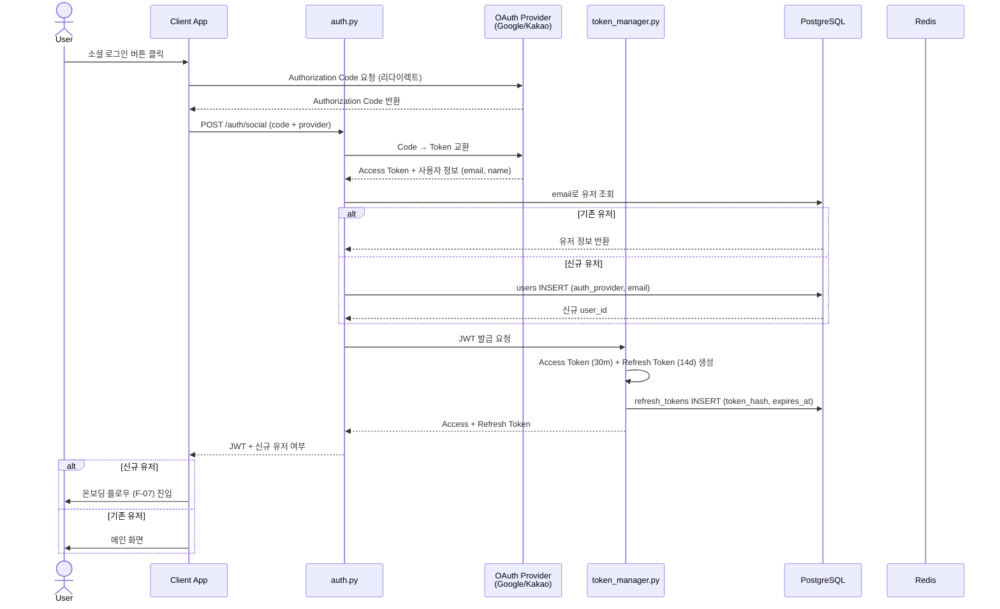
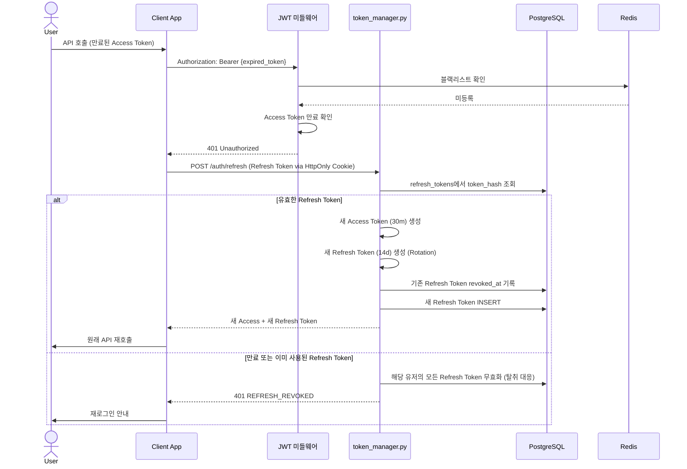
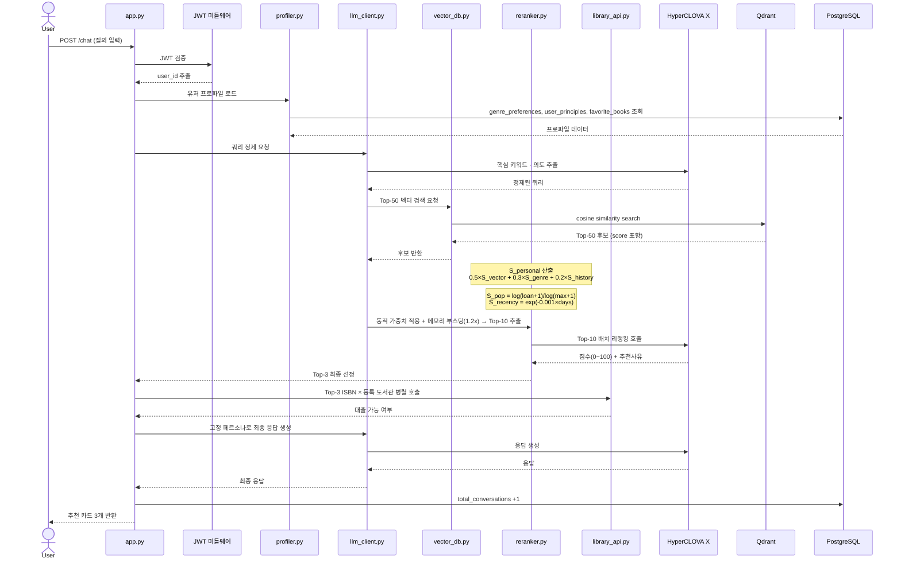
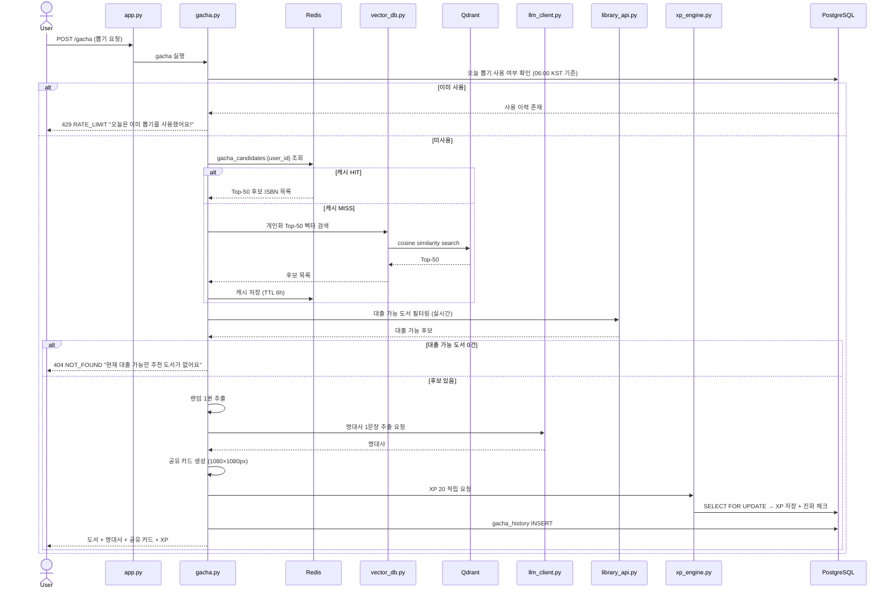
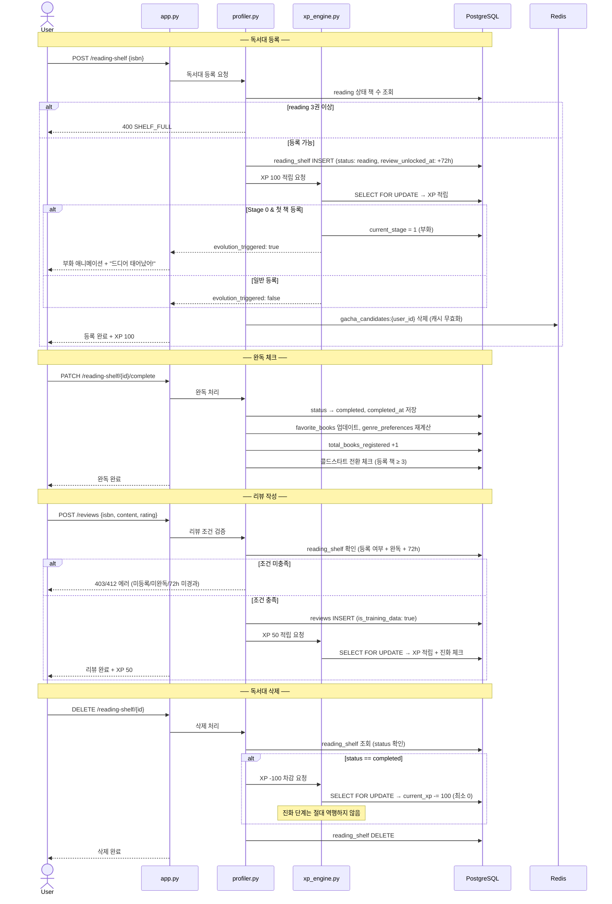
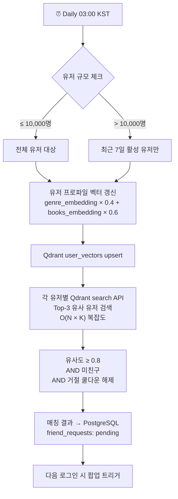
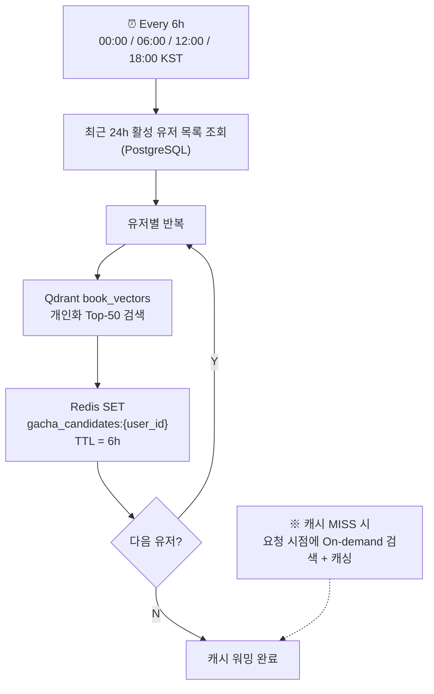
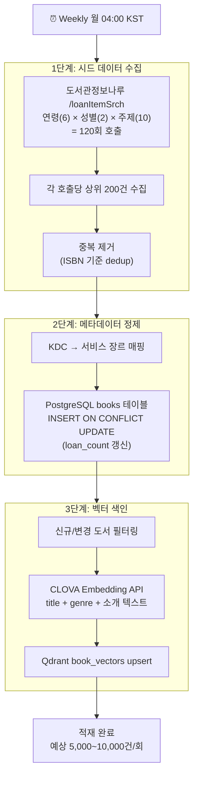
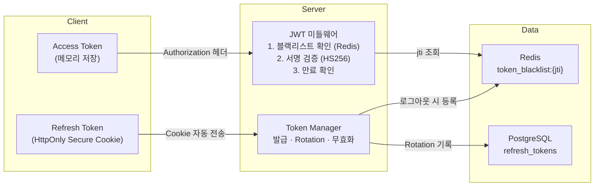

## 0. 문서 정보

|항목|내용|
|---|---|
|프로젝트명|북켓몬 (Bookemon)|
|버전|v2.0|
|최종 수정일|2026-04-21|
|작성 근거|기능 명세서 v2.0|

> **v2.0 주요 변경 요약**
> 
> - Auth Layer 신규 추가 (소셜 OAuth + 자체 가입 + JWT Refresh Rotation)
> - Cache Layer(Redis) 신규 추가 (뽑기 캐싱, 토큰 블랙리스트, 세션)
> - RDB: SQLite → PostgreSQL 확정 (XP 동시성 SELECT FOR UPDATE)
> - 도서 데이터 초기 적재 배치 추가
> - 소셜 매칭 배치: O(N²) → Qdrant Top-K 방식으로 변경
> - Token Manager 모듈 신규

---

## 1. 전체 시스템 아키텍처



---

## 2. 레이어별 역할

### 2-1. Client Layer

|컴포넌트|역할|
|---|---|
|Web / Mobile App|사용자 채팅 UI, 독서대, 뽑기, 소셜, 공유카드 화면. JWT를 Authorization 헤더에 포함하여 API 호출|

### 2-2. Auth Layer (v2.0 신규)

|컴포넌트|역할|
|---|---|
|`api/auth.py`|소셜 로그인(구글/카카오 OAuth 2.0), 자체 가입(이메일+비밀번호 bcrypt), 로그인, 토큰 갱신, 로그아웃 처리|
|`core/token_manager.py`|JWT Access Token(30분) 발급·검증, Refresh Token(14일) 발급·Rotation, 블랙리스트 관리(Redis)|

### 2-3. API Layer

|컴포넌트|역할|
|---|---|
|`app.py`|요청 라우팅, JWT 미들웨어(인증 검증), 페이지네이션 공통 처리, 온보딩(F-07), 공유 카드 생성(F-09) 총괄|

### 2-4. Service Layer

|컴포넌트|담당 기능|
|---|---|
|`services/profiler.py`|F-04 개인화 프로파일링 & 메모리 관리, 독서대(등록·완독·삭제·XP 회수), 리뷰 처리, 콜드스타트 전환|
|`services/gacha.py`|F-02 운명의 책 뽑기(Redis 6h 캐시 우선 조회), F-09 뽑기 카드 생성|
|`services/social.py`|F-08 유저 유사도 매칭(Qdrant Top-K), 친구 요청 처리|
|`services/xp_engine.py`|F-06 XP 적립·차감(SELECT FOR UPDATE), 일일 한도 체크, 진화 이벤트 트리거, 부화(첫 책 등록) 처리|

### 2-5. Core Layer

|컴포넌트|담당 기능|
|---|---|
|`core/vector_db.py`|Qdrant 연결, 도서/유저 벡터 검색 및 색인|
|`core/llm_client.py`|HCX API 호출, 고정 페르소나 System Prompt 관리, 쿼리 정제|
|`core/reranker.py`|Top-10 후보를 LLM으로 재점수화 → 최종 Top-3 선정. S_personal(벡터50%+장르30%+이력20%) / S_pop(Log정규화) / S_recency(지수감쇠) 산출|

### 2-6. Data Layer

|컴포넌트|용도|비고|
|---|---|---|
|PostgreSQL|모든 영구 데이터 (users, reading_shelf, reviews, xp_transactions, refresh_tokens 등 17개 테이블)|XP 동시성: SELECT FOR UPDATE|
|Qdrant|book_vectors(추천 검색), user_vectors(소셜 매칭)|로컬 → Qdrant Cloud 전환 가능|
|Redis|gacha_candidates(6h TTL), token_blacklist(Access TTL), session messages|캐시 장애 시 Qdrant 직접 조회 Fallback|

### 2-7. External APIs

|외부 서비스|호출 주체|용도|
|---|---|---|
|Google / Kakao OAuth|`auth.py`|소셜 로그인 인증|
|HyperCLOVA X|`llm_client.py`, `reranker.py`|쿼리 정제, 응답 생성, 리랭킹, 명대사 추출|
|CLOVA Embedding|도서 적재 배치|도서 메타데이터 벡터화 → Qdrant 색인|
|도서관정보나루 API|`library_api.py`, 도서 적재 배치|소장 여부(`/bookExist`), 도서관 검색(`/libSrch`), 인기 도서(`/loanItemSrch`)|

### 2-8. Batch Jobs

|배치명|스케줄|처리 내용|
|---|---|---|
|소셜 매칭 배치|Daily 03:00 KST|유저 프로파일 벡터 갱신 → Qdrant upsert → 유저별 Top-3 유사 유저 검색(O(N×K)) → 매칭 결과 PostgreSQL 저장|
|뽑기 캐시 워밍|Every 6h (00:00/06:00/12:00/18:00)|활성 유저 대상 개인화 Top-50 후보 벡터 검색 → Redis 캐싱 (On-demand 캐싱도 병행)|
|도서 데이터 적재|Weekly 월 04:00 KST|도서관정보나루 loanItemSrch → books 테이블 upsert → CLOVA Embedding → Qdrant book_vectors upsert|

---

## 3. 주요 요청 흐름

### 3-1. F-00: 인증 플로우 (소셜 로그인)



### 3-2. F-00: 토큰 갱신 플로우



### 3-3. F-01: AI 개인화 큐레이션



### 3-4. F-02: 운명의 책 뽑기



### 3-5. F-04: 독서대 등록 → 완독 → 리뷰 → 삭제



---

## 4. 배치 처리

### 4-1. 소셜 매칭 배치 (F-08)



### 4-2. 뽑기 후보군 캐시 워밍 (F-02)



### 4-3. 도서 데이터 적재 배치 (v2.0 신규)



---

## 5. 인프라 구성

### 5-1. PoC 기준

|항목|내용|
|---|---|
|**런타임**|Python (FastAPI)|
|**RDB**|PostgreSQL (Supabase Free Tier 또는 로컬 Docker)|
|**Vector DB**|Qdrant (로컬 Docker)|
|**캐시**|Redis (로컬 Docker)|
|**LLM**|HyperCLOVA X (CLOVA Studio API)|
|**Embedding**|CLOVA Embedding API|
|**외부 API**|도서관정보나루 (data4library.kr)|
|**카드 생성**|html2canvas / HTML Canvas API (클라이언트 사이드)|
|**배치 스케줄러**|APScheduler|
|**동시 처리**|최소 10명 동시 접속|

### 5-2. 운영 전환 시

|항목|변경 사항|
|---|---|
|**RDB**|PostgreSQL Managed (AWS RDS / Supabase Pro)|
|**Vector DB**|Qdrant Cloud|
|**캐시**|Redis Cloud (Upstash 또는 ElastiCache)|
|**배치 스케줄러**|Celery Beat 또는 Cloud Scheduler|
|**동시 처리**|수평 확장 (컨테이너 오케스트레이션)|
|**모니터링**|Prometheus + Grafana (응답시간, 캐시 히트율, 배치 실행 시간)|

### 5-3. 컨테이너 구성 (Docker Compose)

```
┌────────────────────────────────────────────────┐
│  docker-compose.yml                            │
│                                                │
│  ┌──────────┐  ┌──────────┐  ┌──────────┐     │
│  │ fastapi  │  │ postgres │  │  redis   │     │
│  │ :8000    │  │ :5432    │  │ :6379    │     │
│  └──────────┘  └──────────┘  └──────────┘     │
│  ┌──────────┐  ┌──────────────────────┐       │
│  │  qdrant  │  │  batch-scheduler     │       │
│  │ :6333    │  │  (APScheduler)       │       │
│  └──────────┘  └──────────────────────┘       │
└────────────────────────────────────────────────┘
```

---

## 6. 보안 아키텍처 (v2.0 신규)



|보안 항목|구현|
|---|---|
|비밀번호 저장|bcrypt (cost=12)|
|Access Token|HS256 서명, 30분 만료, jti 포함|
|Refresh Token|14일 만료, Rotation (사용 시 새 토큰 발급 + 기존 무효화)|
|탈취 대응|이미 사용된 Refresh Token 재사용 시 → 해당 유저의 전체 세션 무효화|
|로그아웃|Access Token jti → Redis 블랙리스트 (TTL = 잔여 만료시간)|
|API Key|환경변수 또는 시크릿 매니저 (하드코딩 금지)|
|개인정보|실명·정확한 주소 수집 금지, AES-256 암호화 저장|

---

## 7. 변경 이력

|버전|일자|변경 내용|
|---|---|---|
|v1.0|2026-04-21|초안 작성 (기능 명세서 v1.1 기반 전체 아키텍처 설계)|
|v2.0|2026-04-21|기능 명세서 v2.0 기반 갱신: Auth Layer 신규 추가 (소셜 OAuth + 자체 가입 + JWT Refresh Rotation + Token Manager), Cache Layer(Redis) 신규 추가 (뽑기 6h 캐싱 + 토큰 블랙리스트), RDB SQLite → PostgreSQL 확정 (XP SELECT FOR UPDATE), 도서 데이터 적재 배치 추가 (Weekly), 소셜 매칭 배치 Qdrant Top-K 방식으로 변경, S_personal 3요소 산출 기준 명시, 보안 아키텍처 섹션 신규, 인프라 구성 Docker Compose 추가, 운영 전환 구성 추가|