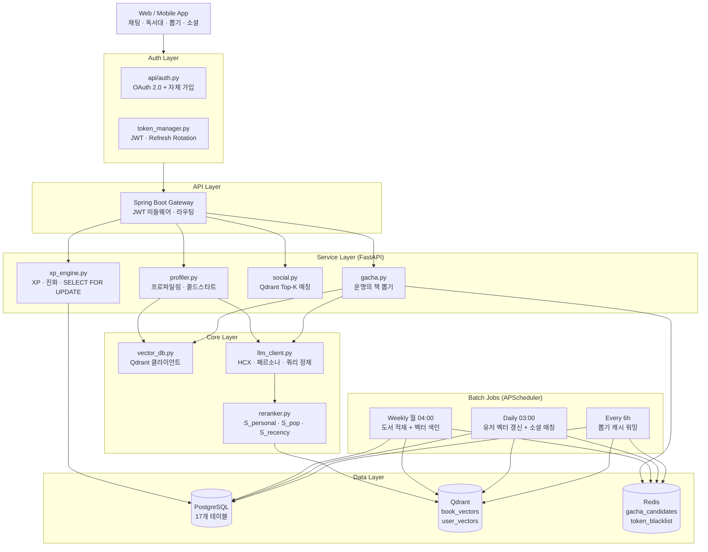
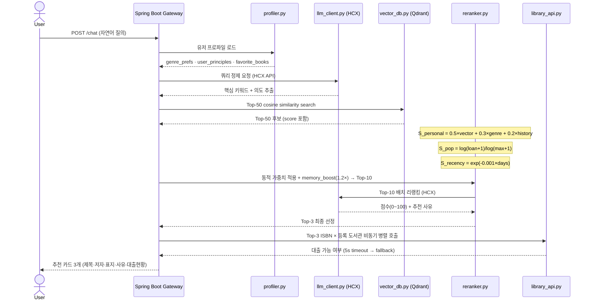
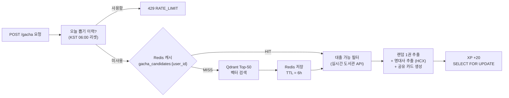
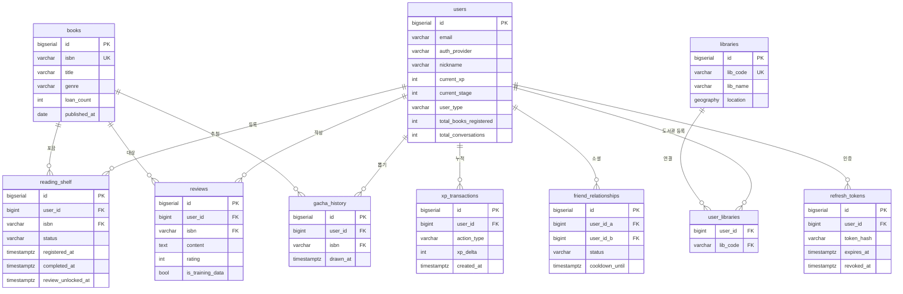
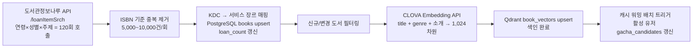
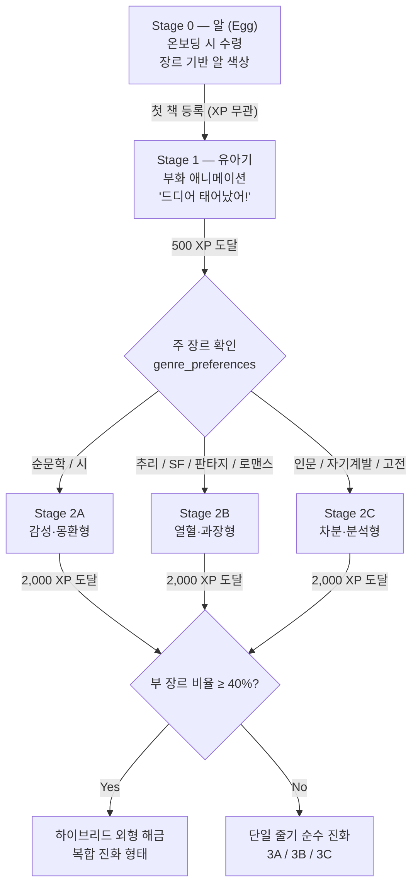

# 북켓몬 (Bookemon) — AI 개인화 도서 큐레이션 서비스

> **포지셔닝** — 기획자가 직접 추천 가중치 수식을 설계하고, 엔지니어와 함께 구현한 다중 목표 최적화 파이프라인 + 게이미피케이션 리텐션 구조

| 항목 | 내용 |
|---|---|
| 프로젝트명 | 북켓몬 (Bookemon) |
| 역할 | 기획 리드 / AI 파이프라인 설계 / 크로스팀 협업 |
| 스택 | React · Spring Boot · FastAPI · PostgreSQL · Qdrant · HyperCLOVA X |
| 규모 | 도서 벡터 100K건 · 17개 RDB 테이블 · 36개 API 엔드포인트 |
| 추천 응답 목표 | ≤ 5초 |

---

## 목차

1. [Hook — 이 포트폴리오의 3가지 서사](#1-hook)
2. [Problem & Insight — 왜 추천만으로는 부족한가](#2-problem--insight)
3. [System Architecture — 전체 시스템 구조](#3-system-architecture)
4. [Core Tech 1 — 다중 목표 추천 파이프라인](#4-core-tech-1--다중-목표-추천-파이프라인)
5. [Core Tech 2 — DB 설계 & 동시성 제어](#5-core-tech-2--db-설계--동시성-제어)
6. [Core Tech 3 — 게이미피케이션 구조](#6-core-tech-3--게이미피케이션-구조)
7. [Collaboration Bridge — 기획자가 수식을 설계한다는 것](#7-collaboration-bridge)
8. [Evaluation Design — 평가 설계](#8-evaluation-design)
9. [Tech Stack](#9-tech-stack)

---

## 1. Hook

> **이 포트폴리오를 관통하는 3가지 서사 — 순서가 곧 논리 구조다**

### Hook 1 — 협업 브릿지 (핵심)

기획자가 직접 `S_personal` 수식 구조를 설계하여 백엔드/AI 엔지니어와 구현 언어를 통일.
수식이 곧 기획 의도를 담은 기술 문서가 된 사례.

> *"어떤 값을 쓸까요?" 라는 협의 없이 기획 명세서가 곧 엔지니어의 구현 스펙이 된다.*

### Hook 2 — 리텐션 위기 돌파 (문제)

단순 추천 서비스의 낮은 재방문율을
다마고치식 진화 게이미피케이션(XP · Stage · 진화 연출)으로 해결한 프로덕트 서사.

### Hook 3 — 다중 목표 최적화 (솔루션)

Dense 벡터 유사도(`S_personal`) × 대중성(`S_pop`) × 최신성(`S_recency`)을 결합한 Reranking 파이프라인.
콜드스타트 유저와 기존 유저를 동적으로 분기 처리.

---

## 2. Problem & Insight

### 문제 정의

기존 도서 추천 서비스들은 **"좋은 책을 보여준다"** 는 기능에는 성공하지만,
사용자가 **다음에 다시 돌아오게 만드는 이유**를 제공하지 못한다.

> **핵심 관찰** — 추천 정확도를 높여도 재방문율은 비선형으로 반응한다.
> 사용자는 "내일 또 와야 할 이유"가 없으면 이탈한다.

이는 게임 산업이 이미 해결한 문제다 — **진행감(Progression)** 과 **보상 루프(Reward Loop)**.

### 인사이트 — 다마고치 모델 이식

**Step 1. 알 수령 (온보딩)**
회원가입 시 장르 취향 기반의 "북켓몬 알" 부여 → 첫 책 등록으로 부화 유도

**Step 2. XP 적립 행동 설계**
독서대 등록(100 XP), 리뷰 작성(50 XP), 친구 수락(40 XP)
→ 모든 독서 행동이 보상으로 연결

**Step 3. 진화 & 분기 (장기 목표)**
주 장르에 따라 Stage 2가 3개 줄기로 분기
→ 최종 진화는 부 장르 비율에 따라 하이브리드 해금

### 결과적 설계 원칙

추천 정확도(AI 파이프라인)와 재방문 동기(게이미피케이션)를 독립적으로 설계하되,
XP 트리거를 추천 결과 소비 행동(독서대 등록, 리뷰)에 연결함으로써 두 시스템을 유기적으로 결합.

---

## 3. System Architecture

### 전체 스택 구성

```
React (Frontend)
    ↓ HTTP / WebSocket
Spring Boot 3 · Java 21 (API Gateway · 인증 · 비즈니스 로직)
    ↓ Internal API
FastAPI · Python (AI Server · 벡터 연산 · LLM 추론)
    ↓
PostgreSQL + PostGIS  │  Qdrant Vector DB  │  Redis
```

**레이어 분리 원칙** — Spring Boot(인증·라우팅·비즈니스 로직)와 FastAPI(AI 추론·벡터 연산)를 분리하여
ML 모델 교체 시 백엔드 변경 없이 AI 서버만 롤링 업데이트 가능.

---

### 전체 아키텍처 다이어그램



---

### 레이어별 역할 요약

| 레이어 | 컴포넌트 | 핵심 역할 | 기술 |
|---|---|---|---|
| Auth | `auth.py` · `token_manager.py` | OAuth 2.0 소셜 로그인, JWT Refresh Rotation, Redis 블랙리스트 | bcrypt · HS256 · HttpOnly Cookie |
| API Gateway | Spring Boot | JWT 미들웨어, 라우팅, 페이지네이션 | Spring Security · JPA |
| AI Profiling | `profiler.py` | 콜드스타트 전환(대화 ≥20 or 책 ≥3), 장르 선호도 재계산 | FastAPI · PostgreSQL |
| Reranker | `reranker.py` | S_personal · S_pop · S_recency 합산 → LLM 배치 리랭킹 | HyperCLOVA X API |
| XP Engine | `xp_engine.py` | XP 적립·차감, 일일 한도, 진화 이벤트 트리거 | PostgreSQL SELECT FOR UPDATE |
| Gacha | `gacha.py` | Redis 6h 캐시 우선 조회, On-demand Fallback, 공유 카드 생성 | Redis · Qdrant · HCX |
| Social | `social.py` | O(N²) → Qdrant Top-K로 개선, 유사도 ≥0.8 매칭, 30일 쿨다운 | Qdrant user_vectors |

---

### Monorepo 구조

```
book-curation/
├── apps/
│   ├── backend/               # Spring Boot Java 21 — 인증·비즈니스 로직
│   ├── frontend/              # React + Vite SPA
│   ├── ai-server/             # FastAPI — RAG · LLM · 벡터 연산
│   ├── gte-reranker-server/   # GTE Reranker 전용 서버
│   └── kure-embedding-server/ # KURE Embedding 전용 서버
├── packages/
│   ├── prompts/               # LLM 프롬프트 템플릿 (공유)
│   └── shared-contracts/      # API 계약 · JSON 스키마
└── database/
    ├── ddl/                   # PostgreSQL DDL (PostGIS 포함)
    ├── migrations/
    └── seed/
```

---

## 4. Core Tech 1 — 다중 목표 추천 파이프라인

> **설계 의도** — Dense 벡터 검색(정확도)만으로는 인기 없는 책을 지나치게 상위에 올리거나,
> 오래된 책만 추천하는 문제가 발생한다. 기획 단계에서 3개 목표 함수를 명시적으로 정의하고,
> 유저 상태에 따라 가중치를 동적으로 전환하는 방식을 설계했다.

---

### 추천 수식 (Scoring Formula)

```
final_score = w₁ × S_personal + w₂ × S_pop + w₃ × S_recency

S_personal  = 0.5 × S_vector + 0.3 × S_genre + 0.2 × S_history
              # Qdrant cosine + 장르 선호도 + 행동 이력

S_pop       = log(loan_count + 1) / log(max_loan + 1)
              # 도서관 대출 통계 Log 정규화

S_recency   = exp(-0.001 × days_since_pub)
              # 출판일 기준 지수 감쇠

memory_boost = 1.2× (user_principle 매칭 도서)
              # 사용자 원칙 우선 부스팅
```

---

### 동적 가중치 전환 (Dynamic Weight Switching)

| 유저 상태 | 조건 | w₁ (S_personal) | w₂ (S_pop) | w₃ (S_recency) | 설계 근거 |
|---|---|---|---|---|---|
| 콜드스타트 (신규) | 대화 < 20회 AND 등록 책 < 3권 | **0.1** | **0.7** | 0.2 | 취향 데이터 부족 → 대중성 위주로 안전한 추천 |
| 기존 (개인화) | 대화 ≥ 20회 OR 등록 책 ≥ 3권 | **0.5** | **0.3** | 0.2 | 행동 이력 축적 → 개인화 벡터 유사도 중심 |

---

### 행동 신호 가중치 (Behavior Signal Weights)

| 행동 | 가중치 | 설계 근거 |
|---|---|---|
| 관심 등록 (Interested) | `1.0` | 의사 표현, 실제 독서 여부 불확실 |
| 독서 중 (Reading) | `2.0` | 적극적 행동 — 실제 시간 투자 |
| 완독 (Finished) | `3.0` | 가장 강한 선호 신호 |
| 리뷰 작성 (5★) | `3.5` | 완독 + 감정 투자까지 한 최상위 신호 |
| 대출 조회 (Loan check) | `0.5` | 약한 흥미 표현, 과대 평가 방지 |

---

### POST /chat 추천 파이프라인 시퀀스



---

### 가챠(운명의 책 뽑기) Redis 캐시 전략



| 시나리오 | 흐름 | 응답 속도 |
|---|---|---|
| 캐시 HIT | Redis 조회 → 대출 필터 → 추출 | 빠름 |
| 캐시 MISS | Qdrant 검색 → Redis 저장(TTL 6h) → 필터 → 추출 | 보통 |
| Redis 장애 | Qdrant 직접 조회 Fallback | 보통 |

---

## 5. Core Tech 2 — DB 설계 & 동시성 제어

> **설계 원칙** — PostgreSQL(영구 데이터) · Qdrant(벡터 인덱스) · Redis(캐시·세션)의 역할을 명확히 분리.
> XP처럼 동시 갱신이 빈번한 필드는 `SELECT FOR UPDATE`로 행 수준 잠금을 적용하여 레이스 컨디션을 원천 차단.

---

### 핵심 테이블 관계도 (ERD)



---

### 동시성 제어 — XP SELECT FOR UPDATE

**문제 상황** — 사용자가 독서대 등록과 뽑기를 거의 동시에 요청할 경우,
두 트랜잭션이 같은 `current_xp`를 읽고 각각 +100, +20을 더하면
실제로는 한 쪽만 적용되는 Lost Update가 발생한다.

```sql
-- xp_engine.py 핵심 로직 (PostgreSQL)
BEGIN;

-- 1. 행 수준 잠금 (다른 트랜잭션 대기)
SELECT current_xp, current_stage
FROM users
WHERE id = :user_id
FOR UPDATE;

-- 2. 일일 한도 체크
SELECT SUM(xp_delta)
FROM xp_daily_logs
WHERE user_id = :user_id
  AND date = CURRENT_DATE;

-- 3. XP 갱신 + 진화 체크 (단방향 — 역행 금지)
UPDATE users
SET   current_xp    = GREATEST(0, current_xp + :delta),
      current_stage = check_evolution(current_xp + :delta)
WHERE id = :user_id;

INSERT INTO xp_transactions (user_id, action_type, xp_delta)
VALUES (:user_id, :action, :delta);

COMMIT; -- 잠금 해제
```

> **진화 단계 역행 금지** — XP를 차감(독서대 삭제 -100 XP)하더라도 `current_stage`는 절대 감소하지 않는다.
> `check_evolution()` 함수는 단방향(증가 전용)으로 설계.

---

### 3-Layer 데이터 전략

| 저장소 | 역할 | 핵심 설계 포인트 |
|---|---|---|
| **PostgreSQL** | 모든 영구 데이터 | PostGIS `GEOGRAPHY` 컬럼으로 도서관 위치 기반 검색 · `SELECT FOR UPDATE` · `INSERT ON CONFLICT UPDATE` |
| **Qdrant** | 도서/유저 벡터 인덱스 | 벡터 차원 1,024 · Cosine distance · 소셜 매칭 O(N²) → O(N×K) 개선 |
| **Redis** | 캐시 & 세션 | `gacha_candidates:{uid}` TTL 6h · `token_blacklist:{jti}` · 장애 시 Qdrant 직접 조회 Fallback |

---

### 도서 데이터 적재 배치 파이프라인



---

## 6. Core Tech 3 — 게이미피케이션 구조

> **핵심 원칙** — 모든 독서 행동(등록·완독·리뷰)이 XP로 전환되고, XP가 북켓몬의 성장으로 가시화된다.
> 사용자는 "책을 읽는 행위"가 아닌 "북켓몬을 키우는 행위"로 서비스를 인식하게 된다.

---

### XP 적립 구조

| 행동 | XP | 일일 한도 |
|---|---|---|
| 독서대 책 등록 | +100 | 3회 |
| 리뷰 작성 | +50 | 3회 |
| 운명의 책 뽑기 | +20 | 1회 |
| 친구 수락 | +40 | — |
| 뽑기 카드 공유 | +30 | 1회 |
| 문장 카드 공유 | +25 | 5회 |
| 출석 체크 | +10 | 1회 |
| 독서대 삭제 (완독 후) | **-100** | — |

---

### 진화 단계 & 분기 구조



> **역행 금지 설계** — XP가 차감되어도 `current_stage`는 절대 감소하지 않는다. DB 트랜잭션 레벨에서 보장.

---

### 독서대 3권 제한의 행동 설계 의도

**제한 없을 때의 문제** — 수십 권을 한꺼번에 등록해 XP를 한 번에 쌓고, 이후 방문 동기가 없어짐. "적립 후 이탈" 패턴 발생.

**3권 제한의 효과** — 완독 → 삭제 → 재등록 사이클을 만들어 **반복 방문을 구조적으로 유도**.
독서 사이클이 곧 재방문 루프.

---

### 리뷰 72시간 잠금의 행동 설계 의도

**즉시 허용 시 문제** — 완독 직후 감정적 리뷰 → 데이터 품질 저하.
AI 추천 학습 데이터로 사용 시 노이즈 증가 (`is_training_data: true` 플래그).

**72시간 잠금의 효과** — 숙성된 감상을 담보.
사용자는 "나중에 리뷰 써야지"라는 재방문 예약이 생긴다. + XP 50을 받기 위한 재방문 유도.

---

## 7. Collaboration Bridge

### 기획자가 수식을 설계한다는 것

이 프로젝트에서 가장 중요한 역할은 **"추천 수식의 가중치를 누가 결정하는가"** 였다.
일반적으로는 ML 엔지니어가 실험을 통해 결정하지만, 이 프로젝트에서는 **기획 의도가 먼저 수식으로 표현되어야 했다.**

---

### 기획 의도 → 수식 변환 과정

**1. 문제 인식**
> "신규 유저에게 취향 기반 추천을 하면 맞히기 어렵고, 틀리면 첫인상이 나빠진다."

**2. 의도 언어화**
> "신규 유저에게는 대중이 검증한 책을 우선 보여주되, 취향 데이터가 쌓이면 서서히 개인화로 전환한다."

**3. 수식 설계 (기획자가 직접)**
```
cold-start: w₁=0.1, w₂=0.7, w₃=0.2
warm-user:  w₁=0.5, w₂=0.3, w₃=0.2
임계값:     대화 ≥20 or 등록 책 ≥3
```

**4. 엔지니어 구현**
수식이 이미 수치로 확정되어 있어
"어떤 값을 쓸까요?" 협의 없이 바로 `reranker.py`에 구현.

**5. 피드백 루프**
Precision@K, NDCG@K 평가 후 가중치 재조정
→ 수식 변경이 곧 기획 명세 변경이 되는 단방향 소통 채널 확립.

---

### 협업 브릿지가 만든 3가지 효과

**공통 언어 확립**
`S_personal`, `S_pop`, `S_recency`는 기획 문서와 코드베이스에서 동일한 이름으로 사용된다.
기획자가 "S_pop 가중치를 0.3으로 낮추자"고 말하면 엔지니어는 즉시 어느 변수를 수정해야 하는지 안다.

**스펙 변경 최소화**
수식이 먼저 확정되어 있으므로 구현 중 재협의가 불필요하다.
기획 의도가 이미 수치로 인코딩되어 있기 때문.

**학습 데이터 설계 연계**
리뷰의 `is_training_data: true` 플래그, 72시간 잠금, 행동 신호 가중치(1.0~3.5) 모두
동일한 기획 언어로 설계되어 AI 엔지니어가 파이프라인 구성 시 별도 해석 없이 바로 사용 가능.

---

### 기획자로서 직접 설계한 기술 명세 목록

| 명세 항목 | 설계 내용 |
|---|---|
| S_personal 3요소 가중치 | `0.5 × vector + 0.3 × genre + 0.2 × history` |
| 콜드스타트 임계값 | 대화 ≥20 OR 등록 책 ≥3 |
| 동적 가중치 전환 수치 | cold `(0.1, 0.7, 0.2)` → warm `(0.5, 0.3, 0.2)` |
| XP 행동별 수치 | 등록 100 · 리뷰 50 · 뽑기 20 · 친구 40 |
| 진화 XP 임계값 | Stage 1→2: 500 XP / Stage 2→3: 2,000 XP |
| 72h 리뷰 잠금 | 학습 데이터 품질 + 재방문 유도 이중 설계 |
| 독서대 3권 제한 | 재방문 루프 구조 설계 |
| Redis TTL 6h | 뽑기 캐시 워밍 주기와 동기화 |
| 배치 스케줄 설계 | Weekly(도서 적재) / Daily(소셜 매칭) / 6h(캐시 워밍) |

---

### 크로스팀 협업 구조

| 팀 | 기술 | 기획자 접점 |
|---|---|---|
| **Frontend** | React · Vite · html2canvas · Web Share API | 카드 UI · 진화 애니메이션 연출 기획 |
| **Backend** | Java 21 · Spring Boot · Spring Security · JPA | API 스펙 · 비즈니스 규칙 정의 |
| **AI Server** | Python · FastAPI · HyperCLOVA X · Qdrant | 수식 명세 · 프롬프트 구조 · 평가 지표 설계 |

---

## 8. Evaluation Design

### 오프라인 평가 지표

| 지표 | 측정 대상 | 활용 |
|---|---|---|
| **Precision@K** | Top-K 중 실제 관련 도서 비율 | 추천 정밀도 측정 |
| **Recall@K** | 알려진 선호 도서 중 Top-K 포착 비율 | 커버리지 측정 |
| **HitRate@K** | Top-K에 정답 1개 이상 포함 여부 | 최소 품질 기준 |
| **NDCG@K** | 순위 가중 정확도 (상위 순위일수록 가중치 높음) | 리랭킹 품질 측정 |
| **MRR** | 첫 번째 정답의 평균 역순위 | Top-1 정확도 근사 |
| **Coverage** | 시스템이 추천 가능한 도서의 다양성 | 롱테일 추천 여부 |
| **LLM Judge** | HCX가 추천 결과를 0~100으로 자가 평가 | 배치 리랭킹 품질 |

---

### 연구 가설 (Research Questions)

| RQ | 가설 | 검증 방법 |
|---|---|---|
| RQ1 | 온보딩 데이터(장르 선호)가 콜드스타트 추천 품질을 유의미하게 개선한다 | 온보딩 유무에 따른 A/B Precision@5 비교 |
| RQ2 | 좋아요/싫어요 피드백이 리랭킹 품질을 향상시킨다 | 피드백 반영 전후 NDCG@5 비교 |
| RQ3 | "독서 중" 상태가 "관심" 대비 더 강한 선호 신호다 | 행동 가중치 ablation 테스트 |
| RQ4 | 벡터 유사도 + 개인화 스코어 결합이 단독 벡터보다 우수하다 | S_personal vs. S_vector-only NDCG@10 |
| RQ5 | SASRec 순차 추천이 현 데이터 규모(100K)에서 실현 가능하다 | PoC 타임라인(6주) 내 구현 가능성 검토 |

---

### 페르소나 기반 평가 설계

실제 유저 데이터 없이 평가하기 위해 합성 페르소나(`synthetic_persona_output/`)를 생성하고,
각 페르소나에 대해 추천 결과의 일관성·정확도·비반복성을 측정.

| 평가 항목 | 방법 |
|---|---|
| 장르 일관성 | 페르소나 장르 선호도와 추천 결과 장르 분포 일치율 |
| 이미 읽은 책 배제 | 추천 결과에 `favorite_books` / `reading_shelf` 중복 없는지 확인 |
| 거부 도서 배제 | `negative_similarity_score` 반영 여부 검증 |
| LLM 자가 평가 | HCX Judge 점수 분포 및 추천 사유 품질 정성 평가 |

---

## 9. Tech Stack

### 기술 스택 전체

| 레이어 | 기술 |
|---|---|
| **Frontend** | React 18 · Vite · TypeScript · html2canvas · Web Share API |
| **Backend** | Java 21 · Spring Boot 3 · Spring Security · JPA/Hibernate · JWT(HS256) |
| **AI Server** | Python 3.11 · FastAPI · HyperCLOVA X · CLOVA Embedding · KURE Embedding · GTE Reranker · APScheduler · LightFM |
| **Database** | PostgreSQL + PostGIS · Qdrant · Redis |
| **Infra** | Docker Compose · GitLab CI/CD · K3s · Cloudflare · NAS |
| **External API** | HyperCLOVA X (CLOVA Studio) · 도서관정보나루 (data4library.kr) · Google/Kakao OAuth 2.0 |

---

### Docker Compose 컨테이너 구성

```yaml
services:
  fastapi:           # :8000  AI Server (추천·벡터·LLM)
  spring-boot:       # :8080  Backend API Gateway
  frontend:          # :3000  React SPA (Vite)
  postgres:          # :5432  PostgreSQL + PostGIS
  qdrant:            # :6333  Vector DB
  redis:             # :6379  Cache + Session
  gte-reranker:      # :8001  GTE Reranker 전용
  kure-embedding:    # :8002  KURE Embedding 전용
```

---

### 운영 전환 시 변경점

| 항목 | PoC | 운영 |
|---|---|---|
| RDB | PostgreSQL (로컬 Docker) | AWS RDS Managed |
| Vector DB | Qdrant (로컬 Docker) | Qdrant Cloud |
| Cache | Redis (로컬 Docker) | Upstash / ElastiCache |
| Scheduler | APScheduler | Celery Beat |
| Orchestration | Docker Compose | K8s (K3s) |
| Monitoring | — | Prometheus + Grafana |

---

### 보안 설계 요약

| 항목 | 구현 |
|---|---|
| 비밀번호 저장 | bcrypt(cost=12) |
| Access Token | HS256 서명 · 30분 만료 · jti 포함 |
| Refresh Token | 14일 만료 · Rotation (사용 시 새 토큰 발급 + 기존 무효화) |
| 탈취 대응 | 이미 사용된 Refresh Token 재사용 시 → 해당 유저 전체 세션 무효화 |
| 로그아웃 | Access Token jti → Redis 블랙리스트 (TTL = 잔여 만료 시간) |
| API Key | 환경변수 (하드코딩 금지) |

---

*북켓몬 (Bookemon) — AI 개인화 도서 큐레이션 서비스 포트폴리오*
*React · Spring Boot · FastAPI · PostgreSQL · Qdrant · HyperCLOVA X*
